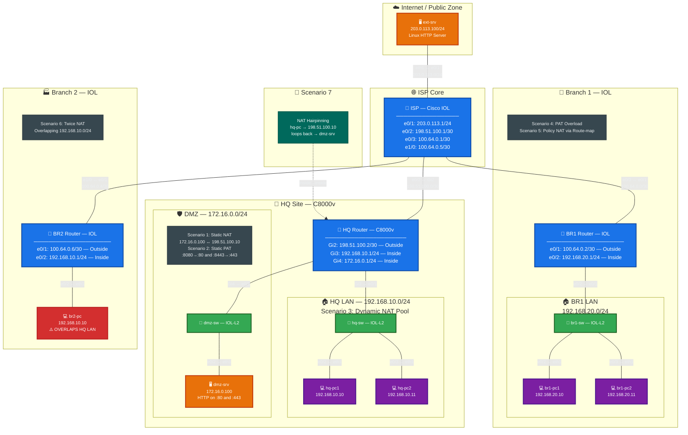

# 🧪 Cisco NAT Masterclass Lab — Containerlab

> A comprehensive, hands-on NAT (Network Address Translation) lab built entirely
> in [Containerlab](https://containerlab.dev/) using Cisco IOS-XE (IOL & C8000v).
> Covers **7 real-world NAT scenarios** from basic static NAT to advanced
> twice-NAT with overlapping address spaces.

---

## 📑 Table of Contents

- [Overview](#-overview)
- [Topology Diagram](#️-topology-diagram)
- [NAT Scenarios](#-nat-scenarios-covered)
- [Prerequisites](#-prerequisites)
- [IP Addressing Plan](#-ip-addressing-plan)
- [File Structure](#-file-structure)
- [Deployment](#-deployment)
- [Accessing Devices](#-accessing-devices)
- [Scenario Walkthroughs](#-scenario-walkthroughs)
  - [Scenario 1 — Static NAT (1:1)](#scenario-1--static-nat-11)
  - [Scenario 2 — Static PAT (Port Forwarding)](#scenario-2--static-pat-port-forwarding)
  - [Scenario 3 — Dynamic NAT (Pool)](#scenario-3--dynamic-nat-pool)
  - [Scenario 4 — PAT / NAT Overload](#scenario-4--pat--nat-overload)
  - [Scenario 5 — Policy NAT (Route-map)](#scenario-5--policy-nat-route-map)
  - [Scenario 6 — Twice NAT (Overlapping Networks)](#scenario-6--twice-nat-overlapping-networks)
  - [Scenario 7 — NAT Hairpinning (Loopback)](#scenario-7--nat-hairpinning-loopback)
- [NAT Debugging & Troubleshooting](#-nat-debugging--troubleshooting)
- [Theory & Concepts Reference](#-theory--concepts-reference)
- [Common Issues & Fixes](#-common-issues--fixes)
- [Cleanup](#-cleanup)
- [Resources](#-resources)

---

## 🔭 Overview

This lab provides a production-realistic environment to learn and practice every
major type of NAT on Cisco IOS / IOS-XE platforms. The topology simulates:

- **An ISP backbone** providing transit between sites
- **A headquarters (HQ)** with a LAN and DMZ, running a C8000v for advanced NAT
- **Two branch offices** running lightweight Cisco IOL routers
- **An external server** simulating an internet host
- **End-user PCs and servers** as Linux containers for traffic generation and testing

### Why This Lab?

| Feature | Benefit |
|---------|---------|
| 7 NAT scenarios in one topology | No need to rebuild — everything coexists |
| Cisco IOL (lightweight) | Runs on modest hardware, boots in ~60 seconds |
| C8000v for advanced features | Full IOS-XE feature set for hairpinning & twice-NAT |
| Linux endpoints with real tools | `curl`, `ping`, `traceroute`, `tcpdump` built in |
| Pre-configured startup configs | Deploy and start learning immediately |
| Fully documented verification | Step-by-step commands for every scenario |

---

## 🗺️ Topology Diagram


## 📋 Diagram Legend

| Color | Meaning |
|-------|---------|
| 🔵 **Blue** | Routers (NAT devices) |
| 🟢 **Green** | L2 Switches |
| 🟠 **Orange** | Servers (HTTP endpoints) |
| 🟣 **Purple** | End-user PCs |
| 🔴 **Red** | Overlapping IP warning (BR2-PC) |

## NAT Scenario Quick Map

| Scenario | Where | Flow Direction |
|----------|-------|----------------|
| **① Static NAT** | HQ Gi2 | ext-srv → `198.51.100.10` → dmz-srv `172.16.0.100` |
| **② Static PAT** | HQ Gi2 | ext-srv → `198.51.100.2:8080` → dmz-srv `:80` |
| **③ Dynamic NAT Pool** | HQ Gi2 | hq-pc1/pc2 → Pool `198.51.100.16-30` → Internet |
| **④ PAT Overload** | BR1 e0/1 | br1-pc1/pc2 → `100.64.0.2` (shared) → Internet |
| **⑤ Policy NAT** | BR1 e0/1 | br1-pc → `203.0.113.0/24` only via route-map |
| **⑥ Twice NAT** | BR2 e0/1 | br2-pc `192.168.10.10`↔`10.10.10.10` src + `10.20.20.10`↔`192.168.10.10` dst |
| **⑦ NAT Hairpin** | HQ Gi3→Gi4 | hq-pc1 → `198.51.100.10` → loops back → dmz-srv `172.16.0.100` |

---

## 🎯 NAT Scenarios Covered

| # | Scenario | Device | Type | Description |
|---|----------|--------|------|-------------|
| 1 | **Static NAT** | HQ (C8000v) | 1:1 | DMZ server `172.16.0.100` ↔ public `198.51.100.10` |
| 2 | **Static PAT** | HQ (C8000v) | Port Forward | `:8080`→`:80` and `:8443`→`:443` on HQ's WAN IP |
| 3 | **Dynamic NAT Pool** | HQ (C8000v) | Many:Many | LAN hosts get IPs from pool `198.51.100.16-30` |
| 4 | **PAT Overload** | BR1 (IOL) | Many:1 | All branch hosts share one public IP |
| 5 | **Policy NAT** | BR1 (IOL) | Route-map | NAT only for traffic to specific destinations |
| 6 | **Twice NAT** | BR2 (IOL) | Src+Dst | Overlapping `192.168.10.0/24` on both sites |
| 7 | **NAT Hairpinning** | HQ (C8000v) | Loopback | Internal hosts access DMZ via its public IP |

---

## ⚙️ Prerequisites

### Hardware Requirements

| Resource | Minimum | Recommended |
|----------|---------|-------------|
| CPU | 4 cores | 8 cores |
| RAM | 8 GB | 16 GB |
| Disk | 15 GB free | 25 GB free |

### Software Requirements

| Software | Version | Purpose |
|----------|---------|---------|
| [Containerlab](https://containerlab.dev/install/) | ≥ 0.48 | Lab orchestration |
| [Docker](https://docs.docker.com/engine/install/) | ≥ 24.0 | Container runtime |
| Linux host | Ubuntu 22.04+ / Debian 12+ | Host OS |

### Cisco Container Images

Ensure the following images are pulled and available locally:

```bash
# Verify images are available
docker images | grep -E "(cisco-iol|cisco-c8000v|cisco-iol-l2)"
```

Required images:

```
ghcr.io/arthur-k-99/cisco-iol         17.15.01    # ISP, BR1, BR2
ghcr.io/arthur-k-99/cisco-iol-l2      17.15.01    # hq-sw, dmz-sw, br1-sw
ghcr.io/arthur-k-99/cisco-c8000v      17.11.01a   # HQ router
```

> **Note:** The `network-multitool` image for Linux endpoints is pulled
> automatically from `ghcr.io/hellt/network-multitool:latest`.

---

## 📋 IP Addressing Plan

### WAN Links

| Link | Subnet | Device A | IP A | Device B | IP B |
|------|--------|----------|------|----------|------|
| ISP ↔ ext-srv | 203.0.113.0/24 | ISP e0/1 | .1 | ext-srv eth1 | .100 |
| ISP ↔ HQ | 198.51.100.0/30 | ISP e0/2 | .1 | HQ Gi2 | .2 |
| ISP ↔ BR1 | 100.64.0.0/30 | ISP e0/3 | .1 | BR1 e0/1 | .2 |
| ISP ↔ BR2 | 100.64.0.4/30 | ISP e1/0 | .5 | BR2 e0/1 | .6 |

### LAN Segments

| Segment | Subnet | Gateway | Connected Hosts |
|---------|--------|---------|-----------------|
| HQ LAN | 192.168.10.0/24 | 192.168.10.1 (HQ Gi3) | hq-pc1 (.10), hq-pc2 (.11) |
| HQ DMZ | 172.16.0.0/24 | 172.16.0.1 (HQ Gi4) | dmz-srv (.100) |
| BR1 LAN | 192.168.20.0/24 | 192.168.20.1 (BR1 e0/2) | br1-pc1 (.10), br1-pc2 (.11) |
| BR2 LAN | 192.168.10.0/24 ⚠️ | 192.168.10.1 (BR2 e0/2) | br2-pc (.10) |

### NAT Address Ranges

| Purpose | Range | Used By |
|---------|-------|---------|
| Static NAT (DMZ) | 198.51.100.10 | Scenario 1 |
| Static PAT | 198.51.100.2:8080, :8443 | Scenario 2 |
| Dynamic NAT Pool | 198.51.100.16 – 198.51.100.30 | Scenario 3 |
| PAT Overload | 100.64.0.2 (BR1 outside intf) | Scenario 4 |
| Twice NAT (BR2 src) | 10.10.10.0/24 | Scenario 6 |
| Twice NAT (HQ as seen by BR2) | 10.20.20.0/24 | Scenario 6 |

---

## 📁 File Structure

```
nat-lab/
├── README.md                          # This file
├── nat-lab.clab.yml                   # Containerlab topology definition
└── configs/
    ├── isp.partial.cfg                # ISP router startup (partial)
    ├── hq.cfg                         # HQ router startup (full config)
    ├── br1.partial.cfg                # Branch 1 router startup (partial)
    └── br2.partial.cfg                # Branch 2 router startup (partial)
```

> **Partial vs Full configs:**
> - `.partial.cfg` files are **appended** to the default IOL config (preserves management)
> - `hq.cfg` is a **full replacement** config (required by C8000v kind)

---

## 🚀 Deployment

### Step 1: Clone and Navigate

```bash
mkdir nat-lab && cd nat-lab
# Place nat-lab.clab.yml and configs/ directory here
```

### Step 2: Verify Directory Structure

```bash
$ tree
.
├── configs
│   ├── br1.partial.cfg
│   ├── br2.partial.cfg
│   ├── hq.cfg
│   └── isp.partial.cfg
├── nat-lab.clab.yml
└── README.md
```

### Step 3: Deploy the Lab

```bash
sudo containerlab deploy -t nat-lab.clab.yml
```

### Step 4: Monitor Boot Progress

```bash
# C8000v takes the longest (~3-5 minutes)
sudo docker logs -f clab-nat-lab-hq

# IOL nodes boot in ~30-60 seconds
sudo docker logs -f clab-nat-lab-isp
sudo docker logs -f clab-nat-lab-br1
sudo docker logs -f clab-nat-lab-br2
```

### Step 5: Verify All Nodes Are Running

```bash
sudo containerlab inspect -t nat-lab.clab.yml
```

Expected output:

```
+---+-------------------+--------------+----------------------------+-------+---------+------------------+--------------+
| # |       Name        | Container ID |           Image            | Kind  |  State  |   IPv4 Address   | IPv6 Address |
+---+-------------------+--------------+----------------------------+-------+---------+------------------+--------------+
| 1 | clab-nat-lab-br1     | xxxxxxxxxxxx | cisco-iol:17.15.01      | cisco_iol    | running | 172.20.20.x/24 | N/A |
| 2 | clab-nat-lab-br1-pc1 | xxxxxxxxxxxx | network-multitool       | linux        | running | 172.20.20.x/24 | N/A |
| 3 | clab-nat-lab-br1-pc2 | xxxxxxxxxxxx | network-multitool       | linux        | running | 172.20.20.x/24 | N/A |
| 4 | clab-nat-lab-br1-sw  | xxxxxxxxxxxx | cisco-iol-l2:17.15.01   | cisco_iol    | running | 172.20.20.x/24 | N/A |
| 5 | clab-nat-lab-br2     | xxxxxxxxxxxx | cisco-iol:17.15.01      | cisco_iol    | running | 172.20.20.x/24 | N/A |
| 6 | clab-nat-lab-br2-pc  | xxxxxxxxxxxx | network-multitool       | linux        | running | 172.20.20.x/24 | N/A |
| 7 | clab-nat-lab-dmz-srv | xxxxxxxxxxxx | network-multitool       | linux        | running | 172.20.20.x/24 | N/A |
| 8 | clab-nat-lab-dmz-sw  | xxxxxxxxxxxx | cisco-iol-l2:17.15.01   | cisco_iol    | running | 172.20.20.x/24 | N/A |
| 9 | clab-nat-lab-ext-srv | xxxxxxxxxxxx | network-multitool       | linux        | running | 172.20.20.x/24 | N/A |
|10 | clab-nat-lab-hq      | xxxxxxxxxxxx | cisco-c8000v:17.11.01a  | cisco_c8000v | running | 172.20.20.x/24 | N/A |
|11 | clab-nat-lab-hq-pc1  | xxxxxxxxxxxx | network-multitool       | linux        | running | 172.20.20.x/24 | N/A |
|12 | clab-nat-lab-hq-pc2  | xxxxxxxxxxxx | network-multitool       | linux        | running | 172.20.20.x/24 | N/A |
|13 | clab-nat-lab-hq-sw   | xxxxxxxxxxxx | cisco-iol-l2:17.15.01   | cisco_iol    | running | 172.20.20.x/24 | N/A |
|14 | clab-nat-lab-isp     | xxxxxxxxxxxx | cisco-iol:17.15.01      | cisco_iol    | running | 172.20.20.x/24 | N/A |
+---+-------------------+--------------+----------------------------+-------+---------+------------------+--------------+
```

---

## 🔗 Accessing Devices

### Cisco Routers (SSH)

```bash
# IOL nodes
ssh admin@clab-nat-lab-isp
ssh admin@clab-nat-lab-br1
ssh admin@clab-nat-lab-br2

# C8000v
ssh admin@clab-nat-lab-hq

# Default credentials: admin / admin
```

### Linux Endpoints (Docker exec)

```bash
# End-user PCs
sudo docker exec -it clab-nat-lab-hq-pc1 bash
sudo docker exec -it clab-nat-lab-hq-pc2 bash
sudo docker exec -it clab-nat-lab-br1-pc1 bash
sudo docker exec -it clab-nat-lab-br1-pc2 bash
sudo docker exec -it clab-nat-lab-br2-pc bash

# Servers
sudo docker exec -it clab-nat-lab-dmz-srv bash
sudo docker exec -it clab-nat-lab-ext-srv bash
```

---

## 📚 Scenario Walkthroughs

---

### Scenario 1 — Static NAT (1:1)

#### 📖 Concept

Static NAT creates a **permanent one-to-one mapping** between an inside local
address and an inside global address. Every packet from the internal host gets
the same public IP, and external hosts can **initiate connections** to the
internal host via the public IP.

**Use case:** Servers that must be reachable from the internet (web servers,
mail servers, etc.)

#### 🔧 Configuration (on HQ)

```
ip nat inside source static 172.16.0.100 198.51.100.10

interface GigabitEthernet2
 ip nat outside

interface GigabitEthernet4
 ip nat inside
```

#### 🔬 How It Works

```
                  INSIDE                              OUTSIDE
  dmz-srv                    HQ Router                         ext-srv
 172.16.0.100  ──────>  NAT Translation  ──────>  203.0.113.100
               src: 172.16.0.100        src: 198.51.100.10
               dst: 203.0.113.100       dst: 203.0.113.100

 172.16.0.100  <──────  NAT Translation  <──────  203.0.113.100
               src: 203.0.113.100       src: 203.0.113.100
               dst: 172.16.0.100        dst: 198.51.100.10
```

#### ✅ Verification

```bash
# Step 1: From ext-srv, ping the DMZ server's PUBLIC IP
docker exec -it clab-nat-lab-ext-srv ping -c 3 198.51.100.10

# Step 2: From ext-srv, HTTP request to DMZ server
docker exec -it clab-nat-lab-ext-srv curl -s http://198.51.100.10

# Step 3: On HQ router, check translations
HQ# show ip nat translations
# Expected:
# Pro  Inside global    Inside local     Outside local    Outside global
# ---  198.51.100.10    172.16.0.100     ---              ---
# icmp 198.51.100.10    172.16.0.100     203.0.113.100    203.0.113.100

# Step 4: Check counters
HQ# show ip nat statistics
```

#### 🎓 Key Learning Points

- Static NAT is **bidirectional** — external hosts CAN initiate connections
- The translation exists permanently in the NAT table (even with no traffic)
- Uses one public IP per internal host (not scalable for many hosts)

---

### Scenario 2 — Static PAT (Port Forwarding)

#### 📖 Concept

Static PAT (Port Address Translation) maps a **specific port** on an external
IP to a **specific port** on an internal host. This allows you to host multiple
services behind a single public IP by differentiating them by port number.

**Use case:** Hosting multiple services with limited public IPs, mapping
non-standard external ports to standard internal ports.

#### 🔧 Configuration (on HQ)

```
ip nat inside source static tcp 172.16.0.100 80  198.51.100.2 8080
ip nat inside source static tcp 172.16.0.100 443 198.51.100.2 8443
```

#### 🔬 How It Works

```
  ext-srv                                              dmz-srv
  203.0.113.100                                        172.16.0.100

  dst: 198.51.100.2:8080  ──>  NAT  ──>  dst: 172.16.0.100:80
  dst: 198.51.100.2:8443  ──>  NAT  ──>  dst: 172.16.0.100:443
```

#### ✅ Verification

```bash
# Step 1: Test HTTP via port 8080
docker exec -it clab-nat-lab-ext-srv curl -s http://198.51.100.2:8080

# Step 2: Test HTTPS via port 8443
docker exec -it clab-nat-lab-ext-srv curl -sk https://198.51.100.2:8443

# Step 3: Verify translations on HQ
HQ# show ip nat translations
# Expected:
# Pro  Inside global        Inside local        Outside local  Outside global
# tcp  198.51.100.2:8080    172.16.0.100:80     ---            ---
# tcp  198.51.100.2:8443    172.16.0.100:443    ---            ---

# Step 4: Test that direct port 80 from outside does NOT work
# (because there's no NAT rule for 198.51.100.2:80)
docker exec -it clab-nat-lab-ext-srv curl -s --connect-timeout 3 http://198.51.100.2:80
# Expected: Connection timeout / refused
```

#### 🎓 Key Learning Points

- Multiple services can share a single public IP
- External port ≠ internal port (port remapping)
- Only specified ports are forwarded — provides implicit security
- Static PAT entries are protocol-specific (`tcp` or `udp`)

---

### Scenario 3 — Dynamic NAT (Pool)

#### 📖 Concept

Dynamic NAT maps internal addresses to a **pool of public addresses**
on a first-come, first-served basis. Unlike PAT, each internal host gets
its **own dedicated public IP** (no port multiplexing). When the pool is
exhausted, new connections are **denied**.

**Use case:** When you need one-to-one mappings but have enough public IPs,
or when applications don't work well with PAT.

#### 🔧 Configuration (on HQ)

```
ip nat pool HQ-PUBLIC-POOL 198.51.100.16 198.51.100.30 netmask 255.255.255.240

ip access-list standard HQ-LAN-HOSTS
 permit 192.168.10.0 0.0.0.255

ip nat inside source list HQ-LAN-HOSTS pool HQ-PUBLIC-POOL
```

#### 🔬 How It Works

```
  hq-pc1 (192.168.10.10) ──> Gets 198.51.100.16 from pool
  hq-pc2 (192.168.10.11) ──> Gets 198.51.100.17 from pool
  ...
  15th host                ──> Gets 198.51.100.30 (last IP)
  16th host                ──> DENIED (pool exhausted!)
```

#### ✅ Verification

```bash
# Step 1: Generate traffic from hq-pc1
docker exec -it clab-nat-lab-hq-pc1 ping -c 5 203.0.113.100

# Step 2: Simultaneously from hq-pc2
docker exec -it clab-nat-lab-hq-pc2 ping -c 5 203.0.113.100

# Step 3: Check translations — each PC should have a DIFFERENT public IP
HQ# show ip nat translations
# Expected:
# Pro Inside global     Inside local     Outside local   Outside global
# --- 198.51.100.16     192.168.10.10    ---             ---
# --- 198.51.100.17     192.168.10.11    ---             ---

# Step 4: Check pool utilization
HQ# show ip nat statistics
# Look for:
#   pool HQ-PUBLIC-POOL: netmask 255.255.255.240
#     start 198.51.100.16 end 198.51.100.30
#     type generic, total addresses 15, allocated 2, misses 0

# Step 5: Clear one translation and watch it get re-allocated
HQ# clear ip nat translation *
```

#### 🎓 Key Learning Points

- Pool exhaustion is a real risk — monitor `misses` counter
- Dynamic NAT translations have a **timeout** (default 86400s for TCP)
- Unlike Static NAT, external hosts **cannot initiate** connections
- No port sharing — each host needs its own public IP

---

### Scenario 4 — PAT / NAT Overload

#### 📖 Concept

PAT (Port Address Translation), also called **NAT Overload**, translates
multiple internal addresses to a **single public IP** by differentiating
flows using **unique source port numbers**. This is the most common form
of NAT used in homes and offices worldwide.

**Use case:** When you have many internal hosts but only one (or few)
public IPs.

#### 🔧 Configuration (on BR1)

```
ip access-list extended PAT-GENERAL
 deny   ip 192.168.20.0 0.0.0.255 203.0.113.0 0.0.0.255
 permit ip 192.168.20.0 0.0.0.255 any

ip nat inside source list PAT-GENERAL interface Ethernet0/1 overload
```

> **Note:** The `deny` statement excludes traffic matching Scenario 5
> (Policy NAT) to prevent conflicts. General internet traffic is PATed.

#### 🔬 How It Works

```
  br1-pc1 (192.168.20.10:49001)  ──>  100.64.0.2:1024  ──>  203.0.113.100
  br1-pc2 (192.168.20.11:49001)  ──>  100.64.0.2:1025  ──>  203.0.113.100
  br1-pc1 (192.168.20.10:49002)  ──>  100.64.0.2:1026  ──>  203.0.113.100

  Same public IP (100.64.0.2), different source ports!
```

#### ✅ Verification

```bash
# Step 1: From br1-pc1, curl the external server
docker exec -it clab-nat-lab-br1-pc1 curl -s http://198.51.100.1

# Step 2: Simultaneously from br1-pc2
docker exec -it clab-nat-lab-br1-pc2 curl -s http://198.51.100.1

# Step 3: On ext-srv, capture packets to see the source
docker exec -it clab-nat-lab-ext-srv tcpdump -i eth1 -n -c 10

# Step 4: Check translations on BR1
BR1# show ip nat translations
# Expected: Both PCs share 100.64.0.2 but with different ports
# tcp 100.64.0.2:1024    192.168.20.10:49001  198.51.100.1:80   198.51.100.1:80
# tcp 100.64.0.2:1025    192.168.20.11:49002  198.51.100.1:80   198.51.100.1:80

# Step 5: Check stats
BR1# show ip nat statistics
# Look for: Total active translations, dynamic, extended
```

#### 🎓 Key Learning Points

- PAT can support ~65,000 concurrent flows per public IP
- The `overload` keyword enables PAT (without it, it's 1:1 Dynamic NAT)
- `interface` keyword means "use whatever IP is on that interface"
- External hosts **cannot initiate** connections (no inbound mapping)
- Most common NAT type in real networks

---

### Scenario 5 — Policy NAT (Route-map)

#### 📖 Concept

Policy NAT uses a **route-map** to apply NAT selectively based on traffic
characteristics (source, destination, protocol, etc.). This allows different
NAT behavior for different traffic flows — for example, translating traffic
to a partner network differently than general internet traffic.

**Use case:** Multi-homed environments, VPN overlap resolution, partner
network access with specific source addresses.

#### 🔧 Configuration (on BR1)

```
ip access-list extended POLICY-NAT-TO-PARTNER
 permit ip 192.168.20.0 0.0.0.255 203.0.113.0 0.0.0.255

route-map POLICY-NAT permit 10
 match ip address POLICY-NAT-TO-PARTNER

ip nat inside source route-map POLICY-NAT interface Ethernet0/1 overload
```

#### 🔬 How It Works

```
  Traffic to 203.0.113.0/24:
    br1-pc1 → MATCHES route-map POLICY-NAT → NAT via policy rule
  
  Traffic to anything else (e.g., 198.51.100.0/24):
    br1-pc1 → DOES NOT match route-map → NAT via PAT-GENERAL (Scenario 4)
```

#### ✅ Verification

```bash
# Step 1: Traffic to partner network (203.0.113.0/24) — matches policy NAT
docker exec -it clab-nat-lab-br1-pc1 curl -s http://203.0.113.100

# Step 2: Traffic to non-partner — matches general PAT (Scenario 4)
docker exec -it clab-nat-lab-br1-pc1 ping -c 3 198.51.100.1

# Step 3: Check translations — should see two different NAT entries
BR1# show ip nat translations

# Step 4: Verify route-map matches
BR1# show route-map POLICY-NAT
# Look for "match clauses" and "policy routing matches"

# Step 5: Debug to see which rule is being hit
BR1# debug ip nat detailed
BR1# terminal monitor
docker exec -it clab-nat-lab-br1-pc1 ping -c 1 203.0.113.100
docker exec -it clab-nat-lab-br1-pc1 ping -c 1 198.51.100.1
BR1# undebug all
```

#### 🎓 Key Learning Points

- Route-maps provide granular control over WHICH traffic gets NATed and HOW
- Multiple NAT policies can coexist on the same router
- ACL ordering matters — the `deny` in PAT-GENERAL prevents double-NATing
- Policy NAT is essential in complex multi-homed or VPN environments

---

### Scenario 6 — Twice NAT (Overlapping Networks)

#### 📖 Concept

Twice NAT translates **both source AND destination** addresses in the same
packet. This is necessary when two sites use **identical IP ranges**
(overlapping/conflicting address spaces) and need to communicate with each other.

**The problem:**
- HQ LAN: `192.168.10.0/24`
- BR2 LAN: `192.168.10.0/24` ← Same subnet!
- Standard routing cannot distinguish the two networks

**The solution:**
- Translate BR2's source: `192.168.10.10` → `10.10.10.10`
- Translate HQ's addresses (as seen by BR2): `192.168.10.10` → `10.20.20.10`
- BR2 hosts communicate with HQ hosts using the "virtual" `10.20.20.0/24` range

#### 🔧 Configuration (on BR2)

```
! Translate BR2 source (inside → globally unique)
ip nat inside source static 192.168.10.10 10.10.10.10

! Translate the destination (HQ addresses as seen from BR2)
ip nat outside source static 192.168.10.10 10.20.20.10

! Route the "virtual" HQ subnet toward ISP
ip route 10.20.20.0 255.255.255.0 100.64.0.5
```

#### 🔬 How It Works

```
  BR2-PC perspective:
    "I'm sending to 10.20.20.10" (thinks it's a unique host)

  What happens on BR2 router:
    Original:     src=192.168.10.10  dst=10.20.20.10
    After NAT:    src=10.10.10.10    dst=192.168.10.10
                        ↑                    ↑
                  BR2's NAT'd          HQ's real
                  source address       address (restored)

  On the wire to ISP:
    src=10.10.10.10  dst=192.168.10.10  → routed to HQ

  Return traffic:
    src=192.168.10.10  dst=10.10.10.10  → routed back to BR2
    BR2 NAT reverses: src=10.20.20.10  dst=192.168.10.10
```

#### ✅ Verification

```bash
# Step 1: Ensure HQ has a route back to BR2's translated range
# (SSH into HQ and add if not present)
HQ# configure terminal
HQ(config)# ip route 10.10.10.0 255.255.255.0 198.51.100.1
HQ(config)# end

# Step 2: From BR2-PC, ping HQ-PC1 via the virtual address
docker exec -it clab-nat-lab-br2-pc ping -c 3 10.20.20.10

# Step 3: Check NAT translations on BR2
BR2# show ip nat translations
# Expected:
#   Pro Inside global   Inside local     Outside local    Outside global
#   --- 10.10.10.10     192.168.10.10    192.168.10.10    10.20.20.10

# Step 4: Tcpdump on HQ to verify received source IP
docker exec -it clab-nat-lab-hq-pc1 tcpdump -i eth1 -n -c 5

# Step 5: Debug NAT on BR2
BR2# debug ip nat
BR2# terminal monitor
# Generate traffic and watch BOTH translations happen per packet
```

#### ⚠️ Additional Setup Required

For full end-to-end connectivity, ensure these routes exist:

| Device | Route | Next Hop | Purpose |
|--------|-------|----------|---------|
| ISP | `10.10.10.0/24` | 100.64.0.6 (BR2) | Return traffic to BR2 |
| ISP | `192.168.10.0/24` | 198.51.100.2 (HQ) | Forward to HQ LAN |
| HQ | `10.10.10.0/24` | 198.51.100.1 (ISP) | Return traffic via ISP |

#### 🎓 Key Learning Points

- Twice NAT solves the overlapping address problem without renumbering
- Both `ip nat inside source` and `ip nat outside source` are used
- The "virtual" address space (10.20.20.0/24) only exists in BR2's NAT table
- Routing must be consistent — all transit devices need correct routes
- This is a common scenario in mergers/acquisitions and VPN connectivity

---

### Scenario 7 — NAT Hairpinning (Loopback)

#### 📖 Concept

NAT Hairpinning (also called NAT Loopback or NAT Reflection) allows
internal hosts to access an internal server using the server's **public IP
address**. The traffic "hairpins" — it exits the inside interface, hits the
NAT rule, gets translated, and is sent back to another inside interface.

**The problem:**
- `dmz-srv` has internal IP `172.16.0.100` and public IP `198.51.100.10`
- External users access it via `198.51.100.10` ✅
- Internal users (hq-pc1) try `198.51.100.10` — without hairpinning, this **fails**
  because the router receives traffic on an inside interface destined for an
  outside address, but the real server is also on an inside interface.

**The solution:**
IOS-XE supports hairpinning natively when both the source and destination are
on `ip nat inside` interfaces and a static NAT entry exists.

#### 🔧 Configuration (on HQ)

```
! The Static NAT from Scenario 1 enables this:
ip nat inside source static 172.16.0.100 198.51.100.10

! Both LAN and DMZ interfaces are "ip nat inside":
interface GigabitEthernet3
 ip nat inside          ! ← hq-pc1 is here

interface GigabitEthernet4
 ip nat inside          ! ← dmz-srv is here
```

> **No additional config needed!** IOS-XE handles inside-to-inside hairpinning
> automatically with static NAT entries.

#### 🔬 How It Works

```
  Step 1: hq-pc1 sends packet
          src=192.168.10.10  dst=198.51.100.10
                                  ↑ public IP of DMZ server

  Step 2: Arrives on HQ Gi3 (ip nat inside)
          Router sees dst matches a NAT "inside global" address
          Translates dst: 198.51.100.10 → 172.16.0.100

  Step 3: Router also translates src (from Dynamic NAT / PAT pool):
          src: 192.168.10.10 → 198.51.100.16

  Step 4: Forwards out Gi4 (ip nat inside → inside = hairpin)
          Packet on wire: src=198.51.100.16  dst=172.16.0.100

  Step 5: dmz-srv responds to 198.51.100.16
          Return traffic follows same NAT path in reverse
```

#### ✅ Verification

```bash
# Step 1: From hq-pc1, access DMZ server via PUBLIC IP
docker exec -it clab-nat-lab-hq-pc1 curl -s http://198.51.100.10

# Step 2: From hq-pc1, ping the public IP
docker exec -it clab-nat-lab-hq-pc1 ping -c 3 198.51.100.10

# Step 3: Verify the hairpin translation on HQ
HQ# show ip nat translations
# Look for entries where BOTH inside global and outside local are translated
# with both Gi3 and Gi4 traffic showing

# Step 4: Compare — also test direct internal access (should also work)
docker exec -it clab-nat-lab-hq-pc1 curl -s http://172.16.0.100

# Step 5: Debug to see the double translation
HQ# debug ip nat
HQ# terminal monitor
docker exec -it clab-nat-lab-hq-pc1 curl -s http://198.51.100.10
# Look for:
#   NAT*: s=192.168.10.10->198.51.100.16, d=198.51.100.10->172.16.0.100
HQ# undebug all
```

#### 🎓 Key Learning Points

- Hairpinning requires both interfaces to be `ip nat inside`
- The source also gets translated (to avoid asymmetric routing)
- Necessary for split-DNS avoidance — users can use a single public URL
- Not all platforms support this — verify on your specific IOS version
- C8000v / IOS-XE handles this natively with static NAT

---

## 🔧 NAT Debugging & Troubleshooting

### Essential Show Commands

```
! ─── NAT Translation Table ───
show ip nat translations                    ! All active entries
show ip nat translations verbose            ! Includes timeouts & flags
show ip nat translations inside             ! Only inside translations
show ip nat translations outside            ! Only outside translations

! ─── NAT Statistics ───
show ip nat statistics                      ! Counters, pool usage, hits/misses
!   Key fields:
!     - Total active translations
!     - Dynamic / static / extended counts
!     - Pool allocation: total, allocated, misses
!     - Hits: number of times existing translation was used
!     - Misses: number of times new translation was created

! ─── Interface NAT Configuration ───
show ip interface GigabitEthernet2 | include NAT
show ip interface GigabitEthernet3 | include NAT
!   Verify inside/outside designation

! ─── ACL Verification ───
show access-lists                           ! All ACLs with match counts
show access-lists HQ-LAN-HOSTS             ! Specific ACL

! ─── Route-map Verification ───
show route-map                              ! All route-maps
show route-map POLICY-NAT                   ! Specific route-map
```

### Debug Commands

```
! ─── Basic NAT Debug ───
debug ip nat                                ! Shows each translation event
!   Format: NAT*: s=SRC->XLATED_SRC, d=DST->XLATED_DST [PORT]

! ─── Detailed NAT Debug ───
debug ip nat detailed                       ! Verbose - shows ACL matches
!   Shows which ACL/route-map matched for each packet

! ─── Packet-level Debug (CAUTION: very verbose!) ───
debug ip packet                             ! Full packet processing debug
debug ip packet detail                      ! Even more detail

! ─── Always enable terminal monitor first ───
terminal monitor

! ─── ALWAYS turn off debugs when done ───
undebug all
! or
no debug all
```

### Clearing NAT State

```
! Clear ALL dynamic translations (static NAT entries persist)
clear ip nat translation *

! Clear specific translation
clear ip nat translation inside 192.168.10.10 outside 203.0.113.100

! Clear and force re-creation (useful after config changes)
clear ip nat translation forced

! Note: Clearing translations may interrupt active connections!
```

### NAT Order of Operations

Understanding the order in which IOS processes NAT is critical for
troubleshooting:

```
  ┌─────────────────────────────────────────────────────────┐
  │              INSIDE → OUTSIDE Traffic Flow               │
  │                                                         │
  │  1. Routing decision (uses INSIDE LOCAL address)        │
  │  2. Check ip nat inside source rules                    │
  │  3. Translate source address                            │
  │  4. Forward packet out outside interface                │
  └─────────────────────────────────────────────────────────┘

  ┌─────────────────────────────────────────────────────────┐
  │              OUTSIDE → INSIDE Traffic Flow               │
  │                                                         │
  │  1. Translate destination (INSIDE GLOBAL → LOCAL)       │
  │  2. Routing decision (uses INSIDE LOCAL address)        │
  │  3. Forward packet out inside interface                 │
  └─────────────────────────────────────────────────────────┘
```

> **Key insight:** For inside-to-outside traffic, **routing happens before NAT**.
> This means your routing table uses the **pre-NAT** (inside local) address.
> For outside-to-inside, **NAT happens before routing** — the routing table
> uses the **post-NAT** (inside local) address.

---

## 📘 Theory & Concepts Reference

### NAT Terminology

| Term | Definition | Example in This Lab |
|------|-----------|---------------------|
| **Inside Local** | Real IP of internal host (before NAT) | `172.16.0.100` (dmz-srv) |
| **Inside Global** | Public IP assigned to internal host (after NAT) | `198.51.100.10` |
| **Outside Local** | IP of external host as seen from inside (usually same as Outside Global) | `203.0.113.100` |
| **Outside Global** | Real IP of external host | `203.0.113.100` |

### Visual Reference

```
              INSIDE               |              OUTSIDE
                                   |
  Inside Local     Inside Global   |  Outside Local    Outside Global
  (real private)   (NAT'd public)  |  (from inside)    (real public)
                                   |
  172.16.0.100 ←→ 198.51.100.10   |  203.0.113.100 ←→ 203.0.113.100
                                   |
              ip nat inside        |         ip nat outside
```

### NAT Types Comparison

| Feature | Static NAT | Dynamic NAT | PAT |
|---------|-----------|-------------|-----|
| Mapping | 1:1 permanent | 1:1 temporary | Many:1 |
| Inbound connections | ✅ Yes | ❌ No | ❌ No |
| Public IPs needed | 1 per host | 1 per concurrent host | 1 per ~65,000 flows |
| Translation lifetime | Permanent | Timeout-based (24h TCP) | Timeout-based (60s default) |
| Use case | Servers | Legacy apps needing unique IPs | General internet access |
| IOS keyword | `static` | `pool <name>` | `overload` |
| Pool exhaustion risk | N/A | ⚠️ Yes | Virtually none |
| Port preserved? | Yes (same port) | Yes (same port) | No (port remapped) |

### NAT Types Decision Flowchart

```text
  Do internal hosts need to be reachable from the internet?
  │
  ├── YES ──► Do you need ALL ports forwarded?
  │           │
  │           ├── YES ──► Static NAT (1:1)          [Scenario 1]
  │           │
  │           └── NO ───► Static PAT (port forward)  [Scenario 2]
  │
  └── NO ───► How many public IPs do you have?
              │
              ├── Many (enough for all hosts) ──► Dynamic NAT Pool  [Scenario 3]
              │
              └── One or very few ──► PAT / Overload                [Scenario 4]
                                      │
                                      └── Need different NAT for
                                          different destinations?
                                          │
                                          ├── YES ──► Policy NAT    [Scenario 5]
                                          └── NO ───► Standard PAT
```

### RFC Address Ranges Used in This Lab

| Range | RFC | Purpose in Lab |
|-------|-----|----------------|
| `192.168.0.0/16` | RFC 1918 | Private LAN addressing |
| `172.16.0.0/12` | RFC 1918 | DMZ private addressing |
| `10.0.0.0/8` | RFC 1918 | Twice-NAT virtual ranges |
| `198.51.100.0/24` | RFC 5737 (TEST-NET-2) | Simulated public IP space (HQ) |
| `203.0.113.0/24` | RFC 5737 (TEST-NET-3) | Simulated internet server space |
| `100.64.0.0/10` | RFC 6598 (CGN) | ISP-to-branch WAN links |

---

## ❗ Common Issues & Fixes

### Issue 1: C8000v Takes Too Long to Boot

**Symptom:** HQ router is unreachable for 5+ minutes after deployment.

**Fix:**
```bash
# Monitor boot progress
sudo docker logs -f clab-nat-lab-hq

# Wait for "Press RETURN to get started" or "Router>" prompt
# C8000v typically needs 3-5 minutes on first boot

# If stuck beyond 10 minutes, check resource availability:
free -h          # Need at least 4GB free RAM
nproc            # Need at least 4 cores total
```

### Issue 2: NAT Translations Not Appearing

**Symptom:** `show ip nat translations` is empty after generating traffic.

**Checklist:**
```
! 1. Verify interfaces have correct NAT designation
show ip interface brief
show running-config | include ip nat

! 2. Ensure ip nat inside/outside are on the correct interfaces
! Common mistake: forgetting to add "ip nat inside" or "ip nat outside"

! 3. Verify the ACL matches your traffic
show access-lists
! Check hit counters — if zero, the ACL isn't matching

! 4. Verify routing — NAT won't translate if the packet can't be routed
show ip route <destination>

! 5. Check that the source/destination are correct
! From Linux container:
docker exec -it clab-nat-lab-hq-pc1 ip addr show eth1
docker exec -it clab-nat-lab-hq-pc1 ip route show
```

### Issue 3: Pool Exhaustion (Dynamic NAT)

**Symptom:** Some hosts can reach the internet but others cannot. `show ip nat statistics` shows `misses` incrementing.

**Fix:**
```
! Option A: Switch to PAT (add overload keyword)
no ip nat inside source list HQ-LAN-HOSTS pool HQ-PUBLIC-POOL
ip nat inside source list HQ-LAN-HOSTS pool HQ-PUBLIC-POOL overload

! Option B: Expand the pool
no ip nat pool HQ-PUBLIC-POOL 198.51.100.16 198.51.100.30 netmask 255.255.255.240
ip nat pool HQ-PUBLIC-POOL 198.51.100.16 198.51.100.62 netmask 255.255.255.192

! Option C: Reduce translation timeouts to free IPs faster
ip nat translation timeout 300
ip nat translation tcp-timeout 300
```

### Issue 4: Policy NAT and Regular PAT Conflict

**Symptom:** Traffic matches the wrong NAT rule, or traffic is double-NATted.

**Fix:**
```
! Ensure your ACLs are mutually exclusive
! The PAT-GENERAL ACL must DENY what POLICY-NAT permits:

ip access-list extended PAT-GENERAL
 deny   ip 192.168.20.0 0.0.0.255 203.0.113.0 0.0.0.255    ← DENY policy traffic
 permit ip 192.168.20.0 0.0.0.255 any                        ← PERMIT everything else

! Verify with debug:
debug ip nat detailed
! Look at which rule each packet matches
```

### Issue 5: Twice NAT Routing Loops or Blackholes

**Symptom:** Packets are dropped or loop between ISP and BR2/HQ.

**Fix — verify these routes exist on ALL devices:**
```
! On ISP:
ip route 10.10.10.0 255.255.255.0 100.64.0.6       ! → BR2 (translated BR2 sources)
ip route 192.168.10.0 255.255.255.0 198.51.100.2    ! → HQ (real HQ LAN)

! On HQ:
ip route 10.10.10.0 255.255.255.0 198.51.100.1      ! → ISP → BR2

! On BR2:
ip route 10.20.20.0 255.255.255.0 100.64.0.5        ! → ISP → HQ
ip route 0.0.0.0 0.0.0.0 100.64.0.5                 ! Default to ISP
```

### Issue 6: NAT Hairpinning Not Working

**Symptom:** hq-pc1 cannot reach `198.51.100.10` even though ext-srv can.

**Fix:**
```
! 1. Verify BOTH interfaces are "ip nat inside"
show run interface GigabitEthernet3 | include nat
show run interface GigabitEthernet4 | include nat
! Both must show "ip nat inside"

! 2. Ensure the source also gets translated (Dynamic NAT or PAT must exist)
! Hairpinning requires source translation for the return path
! The Dynamic NAT Pool from Scenario 3 provides this:
show run | include ip nat inside source list

! 3. If source translation is missing, add PAT as a fallback:
ip nat inside source list HQ-LAN-HOSTS interface GigabitEthernet2 overload

! 4. Debug to see what's happening:
debug ip nat
! Look for BOTH source and destination translations in the same line
```

### Issue 7: Linux Endpoint IP Not Configured

**Symptom:** Linux containers have no IP on `eth1`, only on `eth0` (management).

**Fix:**
```bash
# The exec commands in the topology file run at container start
# If they failed, manually configure:

docker exec -it clab-nat-lab-hq-pc1 ip addr add 192.168.10.10/24 dev eth1
docker exec -it clab-nat-lab-hq-pc1 ip route replace default via 192.168.10.1

# Verify:
docker exec -it clab-nat-lab-hq-pc1 ip addr show eth1
docker exec -it clab-nat-lab-hq-pc1 ip route show
```

### Issue 8: IOL Interfaces Not Coming Up

**Symptom:** IOL interfaces show `administratively down`.

**Fix:**
```
! IOL interfaces are shutdown by default
! The startup config should include "no shutdown" on each interface
! If missing, manually enable:

configure terminal
interface Ethernet0/1
 no shutdown
interface Ethernet0/2
 no shutdown
end
```

---

## 🧹 Cleanup

### Destroy the Lab

```bash
# Graceful shutdown — saves configs and removes containers
sudo containerlab destroy -t nat-lab.clab.yml

# Force destroy (if graceful fails)
sudo containerlab destroy -t nat-lab.clab.yml --cleanup
```

### Clean Up Residual Files

```bash
# Remove the auto-generated lab directory
sudo rm -rf clab-nat-lab/

# Remove Docker networks if orphaned
docker network prune -f

# Check no containers remain
docker ps -a | grep nat-lab
```

### Save Configs Before Destroying

```bash
# Containerlab auto-saves configs on destroy, but to be safe:
sudo containerlab save -t nat-lab.clab.yml
# Configs saved to: clab-nat-lab/configs/
```

---

## 📎 Quick Reference Card

### NAT Configuration Commands

| Scenario | Command |
|----------|---------|
| Static NAT | `ip nat inside source static <local> <global>` |
| Static PAT | `ip nat inside source static tcp <local> <port> <global> <port>` |
| Dynamic NAT | `ip nat inside source list <ACL> pool <POOL>` |
| PAT Overload | `ip nat inside source list <ACL> interface <intf> overload` |
| Policy NAT | `ip nat inside source route-map <RM> interface <intf> overload` |
| Twice NAT (src) | `ip nat inside source static <local> <global>` |
| Twice NAT (dst) | `ip nat outside source static <real> <mapped>` |

### NAT Show Commands

| Command | Purpose |
|---------|---------|
| `show ip nat translations` | View all active translations |
| `show ip nat translations verbose` | View with timeouts and flags |
| `show ip nat statistics` | Pool utilization, hit/miss counters |
| `show access-lists` | Verify ACL match counts |
| `show route-map` | Verify policy NAT route-map |
| `show ip interface <intf> \| inc NAT` | Verify inside/outside designation |

### NAT Debug Commands

| Command | Purpose |
|---------|---------|
| `debug ip nat` | Basic per-packet translation log |
| `debug ip nat detailed` | Verbose with ACL/rule match info |
| `undebug all` | **Always run this when done!** |

### NAT Timeout Defaults

| Protocol | Default Timeout |
|----------|----------------|
| TCP | 86400 seconds (24 hours) |
| UDP | 300 seconds (5 minutes) |
| ICMP | 60 seconds |
| DNS | 60 seconds |
| SYN only (half-open) | 60 seconds |
| FIN/RST (closing) | 60 seconds |

---

## 📚 Resources

### Cisco Documentation

- [IP Addressing: NAT Configuration Guide, IOS-XE 17](https://www.cisco.com/c/en/us/td/docs/ios-xml/ios/ipaddr_nat/configuration/xe-17/nat-xe-17-book.html)
- [NAT Order of Operations](https://www.cisco.com/c/en/us/support/docs/ip/network-address-translation-nat/6209-5.html)
- [Configuring NAT for Overlapping Networks](https://www.cisco.com/c/en/us/support/docs/ip/network-address-translation-nat/13770-1.html)
- [NAT FAQ](https://www.cisco.com/c/en/us/support/docs/ip/network-address-translation-nat/26704-nat-faq-00.html)

### Containerlab Documentation

- [Containerlab Getting Started](https://containerlab.dev/quickstart/)
- [Cisco IOL Kind](https://containerlab.dev/manual/kinds/cisco_iol/)
- [Cisco C8000v Kind](https://containerlab.dev/manual/kinds/c8000v/)

### RFCs

- [RFC 1918 — Private Address Space](https://datatracker.ietf.org/doc/html/rfc1918)
- [RFC 3022 — Traditional IP NAT](https://datatracker.ietf.org/doc/html/rfc3022)
- [RFC 4787 — NAT Behavioral Requirements (UDP)](https://datatracker.ietf.org/doc/html/rfc4787)
- [RFC 5382 — NAT Behavioral Requirements (TCP)](https://datatracker.ietf.org/doc/html/rfc5382)
- [RFC 5737 — IPv4 Address Blocks for Documentation](https://datatracker.ietf.org/doc/html/rfc5737)
- [RFC 6598 — Shared Address Space (100.64.0.0/10)](https://datatracker.ietf.org/doc/html/rfc6598)

---

## 📝 License

This lab is provided for educational purposes. Cisco IOS/IOS-XE images require
appropriate licensing from Cisco Systems. Ensure you have the necessary rights
to use these images in your environment.

---

> **Happy NATting! 🎉**
>
> If you encounter any issues not covered above, use `debug ip nat detailed`
> and `show ip nat translations verbose` — they will tell you exactly what's
> happening with every packet.
```

That completes the full README. Here's a summary of everything included:

| Section | Content |
|---|---|
| **Overview** | Lab purpose, features table, why this lab |
| **Topology Diagram** | ASCII art with all devices and subnets |
| **Scenarios Table** | All 7 scenarios at a glance |
| **Prerequisites** | Hardware, software, images checklist |
| **IP Addressing Plan** | WAN links, LAN segments, NAT ranges |
| **File Structure** | Directory layout with explanations |
| **Deployment** | Step-by-step deploy, monitor, verify |
| **Accessing Devices** | SSH commands for routers, docker exec for Linux |
| **7 Scenario Walkthroughs** | Each with Concept → Config → How It Works → Verification → Key Learnings |
| **Debugging & Troubleshooting** | Show commands, debug commands, NAT order of operations |
| **Theory Reference** | Terminology, visual reference, type comparison, decision flowchart, RFCs |
| **Common Issues & Fixes** | 8 common problems with step-by-step solutions |
| **Cleanup** | Destroy, clean residuals, save configs |
| **Quick Reference Card** | Config commands, show commands, debug commands, timeouts |
| **Resources** | Cisco docs, Containerlab docs, relevant RFCs |